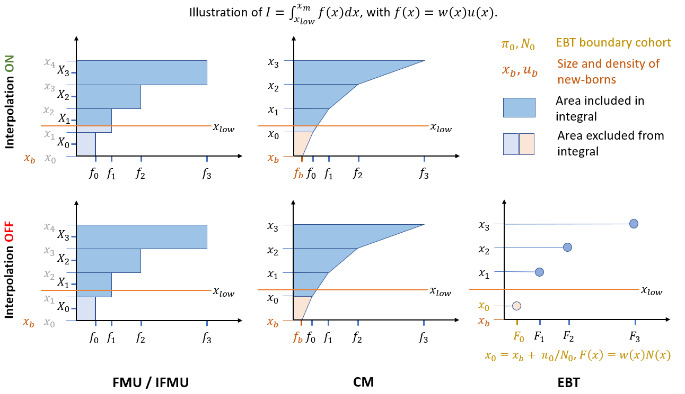

```{r setup, include=FALSE}
knitr::opts_chunk$set(echo = TRUE)
```

In strucured population models, it is often desirable to compute integrals over the physiological state variable $x$, of the form

$$
I = \int_a^b w(x)u(x)dx 
$$

where $w(x)$ is a weight function and $u(x)$ is the density function. 

For example, if $x$ is body size and we want to calculate the biomass of all indiviuals of a species, we can compute the above integral with $w(x)$ defined as the function that scales individual mass with size, such as an allometric equation: $w(x)=\alpha x^\beta$.

## Usage

libpspm provides two functions to easily to calculate size integrals.
E.g., to calculate biomass as in the example above, just define the weights function
```c++
auto w = [a,b](double x, double t){return a*pow(x,b);};
```
and calculate the intgral as 
```c++
integrate_x(w, t, id); // where t = time, id = species id
```
Often, one needs to calculate the integral above a certain size threshold. For example, say a forest census includes only trees above 10 cm diameter, and we want to predict the biomass only in the recorded size classes. Then we want the lower limit of the integral to be $x_{low}=10$ cm, rather than the size at birth. To do so, we can use the function

```c++
integrate_wudx_above(w, t, xlow, id); // where t = time, id = species id
```

## Developer notes


<!--\image html size_integral.png width=700cm-->



In libpspm, the computation of this integral depends on the solver method. For different solvers, the integral is defined as follows:

`FMU:` $\quad I = \sum_{i=i_0}^J h_i w_i u_i$

`EBT:` $\quad I = \sum_{i=i_0}^J w_i N_i$, with $x_0 = x_b + \pi_0/N_0$

`CM :` $\quad I = \sum_{i=i_0}^J h_i  (w_{i+1}u_{i+1}+w_i u_i)/2$

where $i_0 = \text{argmax}(x_i \le x_{low})$, $h_i = x_{i+1}-x_i$, and $w_i = w(x_i)$. 

If interpolation is turned on, $h_{i_0}=x_{i_0+1}-x_{low}$, whereas $u(x_{low})$ is set to $u(x_{i_0})$ in FMU and calculated by bilinear interpolation in CM (See Figure). Interpolation does not play a role in EBT.

In the CM method, the density of the boundary cohort is obtained from the boundary condition of the PDE: $u_b=B/g(x_b)$, where $B$ is the input flux of newborns. In the current implementation of the CM method, $B$ must be set to a constant. In future implementations which may allow real-time calculation of $B$, $u_b$ must be calculated recurvisely by solving $u_b = B(u_b)/g(x_b)$, where $B(u_b) = \int_{x_b}^{x_m} f(x)u(x)dx$.